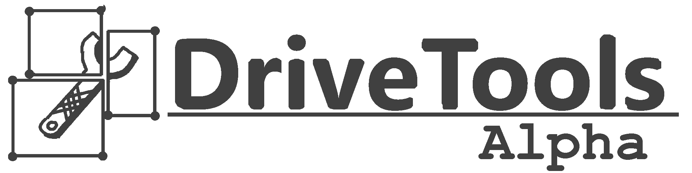
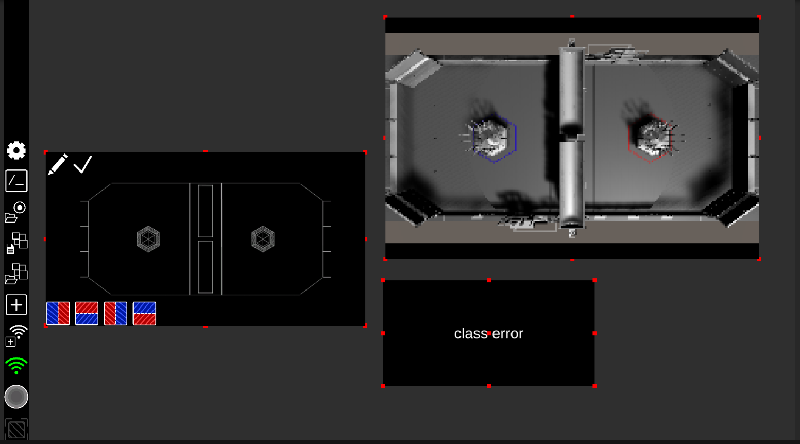

### Welcome! This is Drivetools, an FRC dashboard among other things. It was developed by 10tothe6 for team 2386.

Learn more: https://full-auto-robots.github.io/#dt_about/

# IMPORTANT:
* You CAN use DriveTools if you aren't programming your robot in java, but you'll have to re-write the helper functions yourself. *(if you do let me know, I'll help make them officially supported)*
* If a release is set as a Pre-Release, this means that it hasn't gotten a lot of testing (yet). Beware!

# Installation:
Installing it is pretty easy:
* 1: Go to the "Releases" page, and click whichever is latest.
* 2: Unzip the .zip file, and put the folder into whatever directory you want.
* 3: Launch the app (by double-clicking the .exe file)! It should (hopefully) automatically configure FRC Driverstation to make DriveTools the default driverstation.
* 4: From now on, as long as you have the driverstation dropdown set to "default" DriveTools should launch along with FRC Driverstation.

* 5: Make sure to put the folders that are INSIDE the "\_ROBOT\_" (not the "\_ROBOT\_" folder itself, but it doesn't really matter) into your java robot project. The "\_ROBOT\_" folder has nothing to do with DriveTools itself and is only there to help you manage the more complicated classes.

# Usage:
See the FAR robotics website for info: https://full-auto-robots.github.io/#dt_docs/

# Screenshots:

